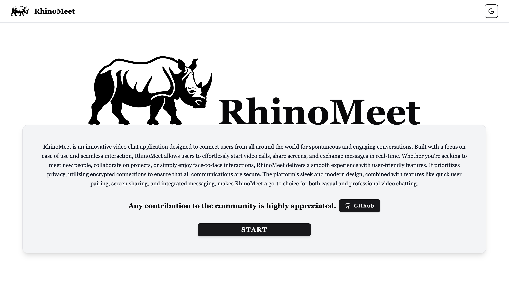
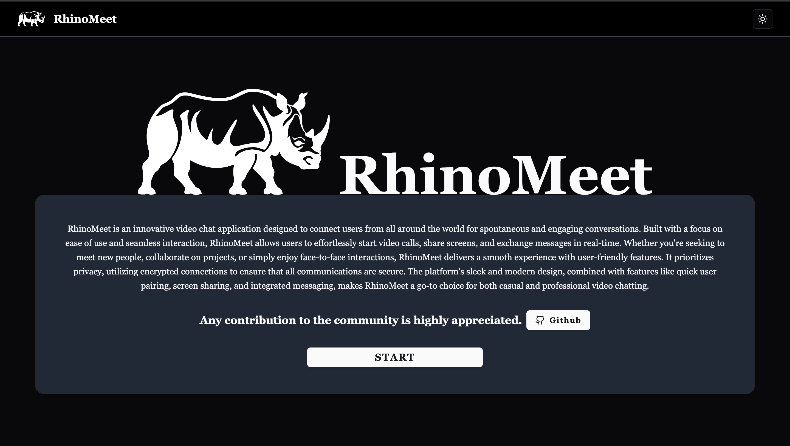
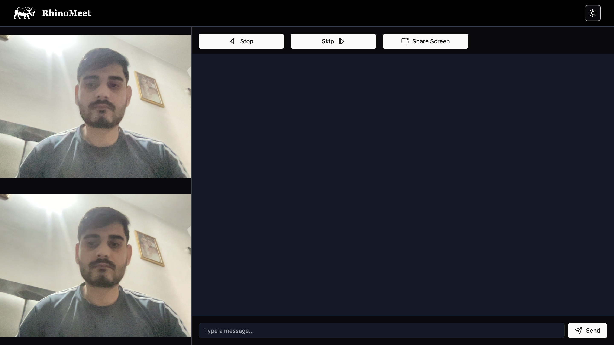
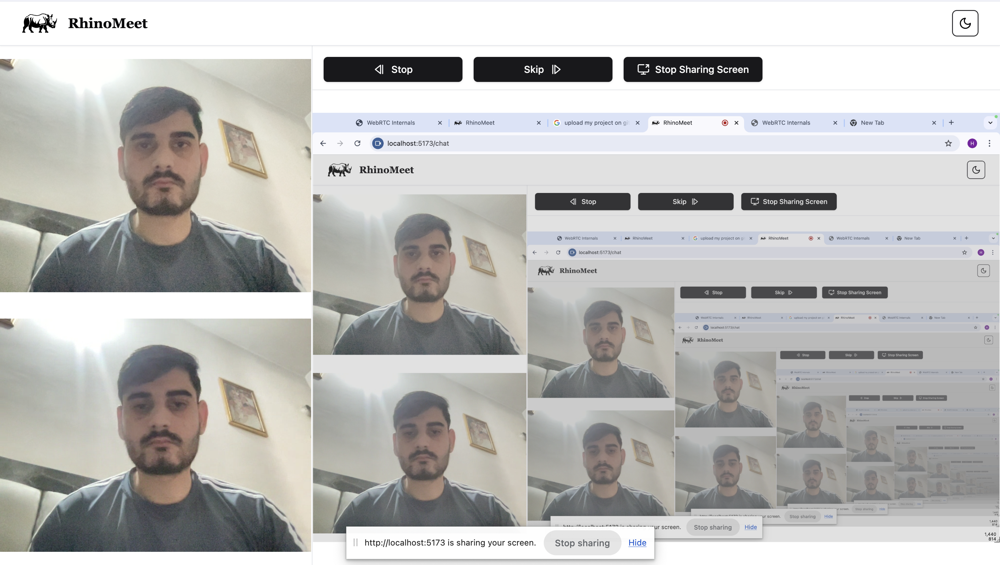
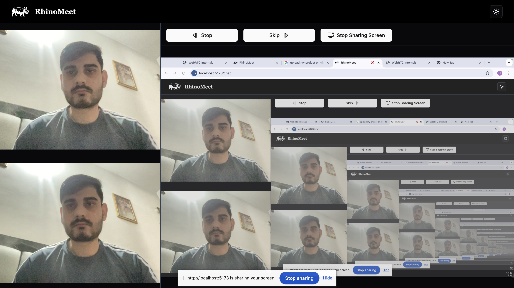

# RhinoMeet

RhinoMeet is a WebRTC-based video chat application inspired by Omegle. It allows users to connect and communicate in real-time via audio, video, and text chat. The application leverages WebSockets for signaling and WebRTC for media transmission between peers. Users can join random video chats with other connected users, enjoy features like screen sharing, skipping users, and real-time text messaging.

## Features

- **Real-time video and audio chat**: Connect instantly with peers using WebRTC technology for seamless communication.
- **Random user matching**: Enjoy the spontaneity of random pairing, just like Omegle, for engaging video chat sessions.
- **Screen sharing**: Share your screen with the connected user during your conversation for added interactivity.
- **Text messaging**: Send and receive real-time messages while on a video chat for a complete chat experience.
- **Skip functionality**: Easily skip the current user and connect with a new one in seconds.
- **Peer-to-peer connection**: High-quality, efficient media transmission powered by WebRTC for smooth video and audio calls.
- **Echo cancellation and noise suppression**: Built-in browser features ensure crisp and clear audio without background noise or echoes.

## Installation

To install and run this project locally, follow these steps:

1. Clone the repository:

    ```bash
    git clone https://github.com/Shobhit2205/RhinoMeet.git
    ```

2. Navigate to the folder:

    ```bash
    cd RhinoMeet
    ```

### Backend Setup

1. Install dependencies:

    ```bash
    cd server
    npm install
    ```

2. Set up environment variables:

   ```bash
    cp .env.example .env
    ```

3. Start the backend server:

    ```bash
    npm run start:dev
    ```

    The server should now be running on [http://localhost:8000](http://localhost:8000).

### Frontend Setup

1. starting frontend and Install dependencies:

    ```bash
    cd client
    npm install
    ```

2. Set up environment variables:

    ```bash
    cp .env.example .env
    ```

3. Start the Frontend:

    ```bash
    npm run dev
    ```

    The client should now be running on [http://localhost:5173](http://localhost:5173).

## Usage

1. Open your browser and navigate to the frontend of your application.
2. Once connected, the application will randomly match you with another online user.
3. You can engage in video chat, share your screen, send messages, and skip users.

## Contributing

1. Fork the repository.
2. Create a new branch:

    ```bash
    git checkout -b feature/your-feature
    ```

3. Make your changes and commit them:

    ```bash
    git commit -m "Add a new feature"
    ```

4. Push your changes:

    ```bash
    git push origin feature/your-feature
    ```

5. Submit a pull request.

## Acknowledgments

- Inspired by [Omegle](https://www.omegle.com/).
- Powered by WebRTC and WebSockets for real-time communication.

## Author

- [Shobhit Pandey](https://github.com/Shobhit2205) - [shobhitpandey2205@gmail.com](shobhitpandey2205@gmail.com)

## Screenshots










